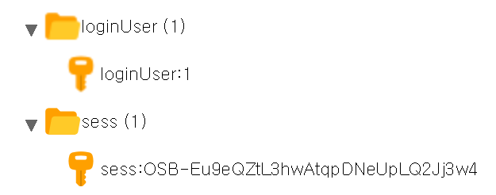

# 구현 내용 설명

웹에서 로그인한 유저를 확인 하기 위해 session을 이용하여 구현 하였음.  
중복 접속에 관한 것도 일단 구현 하긴 했음..  
보안적으로 더 필요한게 있을꺼 같지만 일단 그런부분은 배제함.  
rest-api 형태로 구현(이게 맞는 구현 방법인지는 잘...)  
주고 받는 데이터는 json 형태로 받아서 처리 하도록 만듬.  

## 1. rest api 목록

* post - /account/login - 로그인
* delete - /account/logout - 로그아웃
* get - /user/status - 현재 로그인 상태

## 2. 중복 로그인 처리 방법

session를 저장하는것은 redis이용 하였고  
중복 로그인 체크를 위해 계정에 로그인한 세션 이름을  
별도로 redis에 저장 하도록 구현 하였다.  
정상적으로 로그인 하면 아래 그림과 같이 나온다.  

sess는 RedisStore 가 자동으로 저장 해주는 것이고  
loginUser는 별도로 중복로그인을 체크하기 위해 저장 하는것이다.  
loginUser 뒤에 숫자는 accountUSN 번호 이다.  

여기서 중복 로그인 상태가 되면 기존 session에 iskick에 값을  
저장하여 이전 유저의 중복 로그인으로 로그아웃 처리를 하도록 구현 하였음
